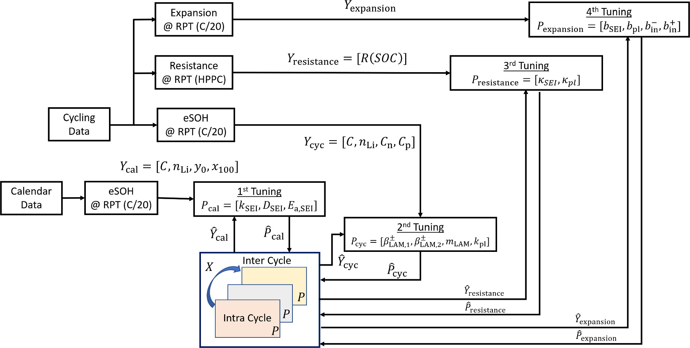

# Code to tune degradation model

The process to tune the degradation model is documented in this [paper](https://iopscience.iop.org/article/10.1149/1945-7111/ad1294) and is summarized in this figure:

We adopt a sequential tuning process and it includes 4 steps:

## Step 1
1. Using calendar aging data for multiple temperatures to tune the SEI model. In this case, the contribution of mechanical damage and Li plating to aging would be negligible.
2. The SEI model is tuned using the data from the calendar aged cells in both cold (-5°C) and hot temperature (45°C) conditions. The reason for doing this is to capture the temperature dependency of SEI growth, being faster at high temperatures and slower at colder temperatures.
3. The vector of degradation mechanism parameters P to be tuned in step 1 are:
$$P_\mathrm{cal} = \left[k_{0,\mathrm{SEI}},D_\mathrm{SEI},E_{a,\mathrm{SEI}}\right]^T $$
4. The vector of data to be fitted against model outputs are:
$$Y_\mathrm{cal} = \left[C, n_\mathrm{Li},y_0,x_{100}\right]^T$$

### Input Data Required:
eSOH parameters $[x_0,x_{100},y_0,y_{100},C_n,C_p,C,n_{Li}]$ at RPTs for calendar aging cells at multiple temperatures

### Output of Tuning:
$$P_\mathrm{cal} = \left[k_{0,\mathrm{SEI}},D_\mathrm{SEI},E_{a,\mathrm{SEI}}\right]^T $$

### Code for executing step:

To perform step 1, please run this [notebook](./step_1_calendar.ipynb)

### Functions
Additional function definitions used in step 1:
#### 1. get_parameter_values()
Loads Mohtat2020 parameter set and sets other parameters in the model which aren't tuned in the tuning process.  
**Inputs**: No Inputs  
**Outputs**: `dictionary of parameter values`   
#### 2. cycle_adaptive_simulation_V2()
Runs accelerated aging simulations  
**Inputs**: `model, parameter values, experiment, initial SOC, save at nth cycle`  
**Outputs**: `dictionary of aging simulation outputs`
#### 3. load_data_calendar()
Loads eSOH and OCV data for a given cell number. Cell numbers are linked to particular cycling conditions  
**Inputs**: `cell number, directory of eSOH data, directory of RPT test data`  
**Outputs**: `string with cell number, dataframe of eSOH data(dfe), cycle number at which RPT data is present(N), dataframe of RPT test data(dfo_0)`
#### 4. init_exp_calendar()
Initializes the model and experiment for the particular cell number. 
**Inputs**: `cell number, dataframe of eSOH data, model internal parameters (spm.param), dictionary of parameter values`
**Outputs**: `active material ratio of negative electrode and positive electrode, initial SOC, Temperature of experiment`

## Step 2
1. After step 1, we tune the mechanical damage model parameters and lithium plating model parameters together using the cycling aging data at multiple C-rates
2. The vector of degradation mechanism parameters P to be tuned in step 2 are:
$$P_\mathrm{cyc} = \left[\beta_\mathrm{LAM,1}^-,\beta_\mathrm{LAM,2}^-,\beta_\mathrm{LAM,1}^+,\beta_\mathrm{LAM,2}^+,m_\mathrm{LAM},k_\mathrm{pl}\right]$$
3. The vector of data to be fitted against model outputs are:
$$Y_\mathrm{cyc} = \left[C, n_\mathrm{Li},C_n,C_p\right]^T$$
4. The parameters $P_{cyc}$ were tuned based on the data sets $Y_{cyc}$ extracted from the RPTs of the cycling cells at charge-discharges rates of C/5-C/5%–100%DOD, 1.5C-1.5C-100%DOD, and C/5-1.5C-100%DOD. The reason for tuning the model using the three cells together is to establish the C-rate dependency of the mechanical damage and Li plating models. Using data from a single C-rate would be insufficient to get the C-rate dependency correct in the model. 
5. Please note that step 2 has to be run after step 1 and we use the values of $P_{cal}$ obtained in step 1 to initialize the model in step 2. The parameters are not set automatically. You have to manually set the parameters obtained in step 1.

### Input Data Required:
1. eSOH parameters $[x_0,x_{100},y_0,y_{100},C_n,C_p,C,n_{Li}]$ at RPTs for cycling aging cells at multiple C-rates
2. Output of step 1 i.e. parameters tuned in step 1.
### Output of Tuning:
$$P_\mathrm{cyc} = \left[\beta_\mathrm{LAM,1}^-,\beta_\mathrm{LAM,2}^-,\beta_\mathrm{LAM,1}^+,\beta_\mathrm{LAM,2}^+,m_\mathrm{LAM},k_\mathrm{pl}\right]$$

### Code for executing step:
To perform step 2, please run this [notebook](./step_2_cycling.ipynb)

### Functions
Additional function definitions used in step 2:

#### 1. load_data()
Loads eSOH and OCV data for a given cell number. Cell numbers are linked to particular cycling conditions  
**Inputs**: `cell number, directory of eSOH data, directory of RPT test data`  
**Outputs**: `string with cell number, dataframe of eSOH data (dfe), dataframe of RPT test data(dfo_0), cycle number at which RPT data is present(N)`
#### 2. init_exp()
Initializes the model and experiment for the particular cell number.  
**Inputs**: `cell number, dataframe of eSOH data, model internal parameters (spm.param), dictionary of parameter values`
**Outputs**: `active material ratio of negative electrode and positive electrode, C-rate of charge, C-rate of discharge, discharge until (50% SOC or 0% SOC), Temperature of experiment, initial SOC`

## Step 3
1. Resistance in the battery increases due to active material loss (resulting in increase in overpotential), SEI growth and Li plating.
2. The parameters in our model which needs to be tuned to match the resistance data are:
$$P_\mathrm{resistance} = [\kappa_\mathrm{SEI},\kappa_\mathrm{pl}]$$
3. These parameters were tuned manually to get the best resistance fit at both low crate (C/5) and high crate (1.5C).

### Input Data Required:
1. eSOH parameters $[x_0,x_{100},y_0,y_{100},C_n,C_p,C,n_{Li}]$ at RPTs for cycling aging cells at multiple C-rates
2. Output of step 1 and step 2 i.e. parameters tuned in steps 1 and 2.
3. Average Resistance values at various RPTs calculated using HPPC test portion of the RPTs.
### Output of Tuning:
$$P_\mathrm{resistance} = [\kappa_\mathrm{SEI},\kappa_\mathrm{pl}]$$

### Code for executing step:
To perform step 3, please run this [notebook](./step_3_resistance.ipynb)

## Step 4
1. In the final step we tune the scaling factors of the expansion growth model:  
$$P_\mathrm{expansion} = \left[b_\mathrm{SEI}, b_\mathrm{pl}, b_\mathrm{in}^-,b_\mathrm{in}^+\right]$$

2. The parameters $P_{expansion}$ were tuned based on the expansion data extracted from the RPTs of the cycling cells at charge-discharges rates of C/5-C/5%–100%DOD, 1.5C-1.5C-100%DOD, and C/5-1.5C-100%DOD.
3. A least squares estimation algorithm was used to find scaling factor values.

### Input Data Required:
1. eSOH parameters $[x_0,x_{100},y_0,y_{100},C_n,C_p,C,n_{Li}]$ at RPTs for cycling aging cells at multiple C-rates
2. Output of steps 1, 2 and 3 i.e. parameters tuned in steps 1, 2 and 3.
3. Expansion data at RPTs for the chose cells

### Output of Tuning:
$$P_\mathrm{expansion} = \left[b_\mathrm{SEI}, b_\mathrm{pl}, b_\mathrm{in}^-,b_\mathrm{in}^+\right]$$

### Code for executing step:
To perform step 4, please run this [notebook](./step_4_expansion.ipynb)